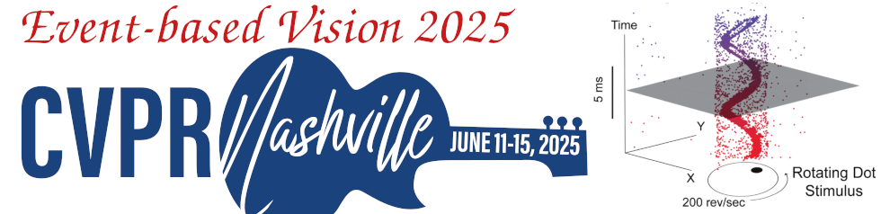

**June 11th or 12th (TBD), 2025, CVPR**, Nashville (TN), USA.
<!-- Starts at **10 am [Eastern Time](https://time.is/ET)**;  4 pm [Europe Time](https://time.is/CET). -->  
Held in conjunction with the [IEEE/CVF Conference on Computer Vision and Pattern Recognition](https://cvpr.thecvf.com/) 2025.

<b>Welcome to the 5th International Workshop on Event-Based Vision!</b>  

## Important Dates

- **Paper submission deadline: March 12**, 2025 (23:59h PST).  <!-- [Submission website (CMT)](https://cmt3.research.microsoft.com/EVENTVISION2025) -->
- **Demo abstract submission: March 12**, 2025 (23:59h PST)
- Notification to authors: April 1, 2025.
- Camera-ready paper: April 7, 2025 (as per CVPR website, deadline set by IEEE)
- [Early-bird registration **April 30th** (23:59h ET)](https://cvpr.thecvf.com/Conferences/2025/Pricing2)
- Standard registration begins May 1st.
- <b>Workshop day: **June June 11th or 12th (TBD), 2025**. Full day workshop.</b>

<!-- Many thanks to all who contributed and made this workshop possible! --> 

<!--
## [Photo Album of the Workshop](https://photos.app.goo.gl/z5gMLG2AF6U5qHcY7)

## [Videos! YouTube Playlist](https://www.youtube.com/playlist?list=PLeXWz-g2If96iotpzgBNNTr9VA6hG-LLK)
-->

## Objectives

Event-based cameras are bio-inspired, asynchronous sensors that offer key advantages of microsecond temporal resolution, low latency, high dynamic range and low power consumption. Because of these advantages, event-based cameras open frontiers that are unthinkable with traditional (frame-based) cameras, which have been the main sensing technology for the past 60 years. These revolutionary sensors enable the design of a new class of efficient algorithms to track a baseball in the moonlight, build a flying robot with the agility of a bee, and perform
structure from motion in challenging lighting conditions and at remarkable speeds. In the last decade, research about these sensors has attracted the attention of industry and academia, fostering exciting advances in the field. The proposed workshop covers the sensing hardware, as well as the processing, data, and learning methods needed to take advantage of the above-mentioned novel cameras. The workshop also considers novel vision sensors, such as
pixel processor arrays, which perform massively parallel processing near the image plane. Because early vision computations are carried out on-sensor (mimicking the retina), the resulting systems have high speed and low-power consumption, enabling new embedded vision applications in areas such as robotics, AR/VR, automotive, gaming, surveillance, etc.

## Topics Covered

- Event-based / neuromorphic vision.
- Algorithms: motion estimation, visual(-inertial) odometry, SLAM, 3D reconstruction, image
intensity reconstruction, optical flow estimation, recognition, segmentation, feature/object
detection, visual tracking, calibration, action understanding, sensor fusion (video synthesis,
events and RGB, events and LiDAR, etc.), model-based, embedded, or learning-based
approaches.
- Event-based representation, signal processing, and control.
- Event-based active vision, event-based sensorimotor integration.
- Event camera datasets and/or simulators.
- Applications in: computational photography, robotics (navigation, manipulation, drones, obstacle avoidance, human-robot interaction,...), automotive, IoT, AR/VR (e.g., smart eyewear), space science, automated inspection, surveillance, crowd counting, physics, biology.
- Novel hardware (cameras, neuromorphic processors, etc.) and/or software platforms, such as
fully event-based systems (end-to-end).
- New trends and challenges in event-based and/or biologically-inspired vision (SNNs, Reservoir
Computing, etc.).
- Efficient computing architectures for Event-based processing (e.g., HD Computing, State
Space Models).
- Near-focal plane processing, such as pixel processor arrays (PPAs).

A longer list of related topics is available in the table of content of the [List of Event-based Vision Resources](https://github.com/uzh-rpg/event-based_vision_resources)

## Call for Contributions

### Research papers

  <b>Research papers</b> and demos are solicited in, but not limited to, the topics listed above.

  - <b>Paper</b> submissions must adhere to the CVPR 2025 paper submission style, format and length restrictions.
  See the <a href="https://cvpr.thecvf.com/Conferences/2025/AuthorGuidelines">author guidelines</a> and <a href="https://github.com/cvpr-org/author-kit/releases">template</a> provided by the CVPR main conference. These submissions are meant to represent novel contributions, i.e., unpublished work (submissions should not have been published, accepted or be under review elsewhere).
   Accepted papers will be published open access through the Computer Vision Foundation (CVF) (see <a href="https://openaccess.thecvf.com/CVPR2023_workshops/EventVision">examples from CVPR Workshop 2023</a>, <a href="https://openaccess.thecvf.com/CVPR2021_workshops/EventVision">2021</a> <a href="https://openaccess.thecvf.com/CVPR2019_workshops/CVPR2019_EventVision">and 2019</a>). We encourage authors of accepted papers to write a paragraph about ethical considerations and impact of their work.
  
  - For <b>demo</b> abstract submission, authors are encouraged to submit an abstract of up to 2 pages using the same template as CVPR 2025 paper submissions.

### Courtesy papers (in the poster session)

  We also solicit contributions of <b>papers relevant to the workshop that are accepted</b> at the CVPR main conference or at other peer-reviewed conferences or journals.
  These contributions will be checked for suitability (soft review) and will not be published in the workshop proceedings.
  Papers should be submitted in single blind format (e.g., accepted version is fine), and should mention if and where the paper has been accepted / published. These contributions provide visibility to your work and help building a community around the topics of the workshop. 
  

## Competitions / Challenges

### Eye-tracking

We are excited to arrange a challenge focused on advancing event-based eye tracking, a key technology for driving innovations in interaction technology and extended reality (XR). 
While current state-of-the-art devices like Apple's Vision Pro or Meta’s Aria glasses utilize frame-based eye tracking with frame rates from 10 to 100 Hz and latency around 11 ms, there is a pressing need for smoother, faster, and more efficient methods to enhance user experience. By leveraging two different event-based eye tracking datasets (the <a href="https://arxiv.org/pdf/2409.15584">Enhanced Ev-Eye dataset</a> and the <a href="https://openaccess.thecvf.com/content/CVPR2024W/AI4Streaming/papers/Wang_Event-Based_Eye_Tracking._AIS_2024_Challenge_Survey_CVPRW_2024_paper.pdf">3ET+ dataset</a>), this challenge offers participants the
opportunity to contribute to cutting-edge solutions that push beyond current limitations. 
Both datasets are readily available, have been ethically collected with full consent and strict privacy
protections, and have been validated. 

Submissions will be evaluated on accuracy and model efficiency to ensure low latency. 
<!-- The competition is scheduled to begin on February 5, 2025, with submissions due by March 15, 2025, and results announced on April 20, 2025. 
--> 
We believe the outcomes of this challenge will play an important role in shaping the future of XR
and interaction technology by pushing the boundaries of what's possible in eye tracking. 

Contact: 
<a href="https://sites.google.com/view/qinyu">Prof. Qinyu Chen</a> and 
<a href="mailto:dperrone@prophesee.ai">Dr. Daniele Perrone</a>

### Space-time Instance Segmentation (SIS) using frames and events

Event cameras react to moving objects in the scene and are a natural fit for all kinds of tracking problems. However, in object tracking event-based solutions lack far behind its conventional frame-based counterparts, in part due to missing annotated data. 
The new open-source <a href="https://github.com/tub-rip/MouseSIS">MouseSIS dataset</a> (ECCVW 2024) aims to overcome this problem with annotations for a task called Space-time Instance Segmentation (SIS), requiring algorithms to predict multi-object tracking and segmentation of all objects (in this case mice) in the scene. 
We are excited to announce the first SIS Challenge. 
It will be hosted on Codalab and evaluated on a non-publicly available test set. 
The dataset contains data and video instance segmentation annotations for mice. 
All recordings adhered to the ethical guidelines under German law. 
Algorithms will be evaluated based on the quality of the tracking predictions judged on the main metric Higher Order Tracking Accuracy (HOTA). As one of the interesting properties of event cameras is their
sparse input, we want to incentivize efficient algorithms and additionally evaluate FLOPS and
runtime per ground truth step (ms). 

In short, submissions will be evaluated in two tracks (frames + events, event-only) and two figures of merit: accuracy and efficiency. 
Participants can train the models using any publicly available open-source dataset, but are requested to submit a technical report with all details alongside their submission and to open-source their code. 
<!-- The tentative timeline is: Challenge starts on January 8th, 2025; Challenge ends on May 9th, 2025; Results are announced on May 16th, 2025. -->
This challenge aims to advance the state of the art in event-based fine-grained tracking for tasks that can be useful for scientific purposes, such as biologist and ecologist, as in the recent breakthrough of DeepLabCut.

Contact: 
<a href="https://friedhelmhamann.github.io/">Friedhelm Hamann</a>

<!-- 
### SLAM
-->

## Speakers
<!--  -->

## Location
- On site (Music City Center, Nashville TN): Room <b>TBD</b>
<!-- - [Virtual: see CVPR virtual platform for zoom link](https://cvpr2023.thecvf.com/virtual/2023/workshop/18456) -->

## Schedule

The tentative schedule is the following:

Time (local) | Session
--- | ---
8:00 | Welcome. Session 1: Event cameras: Algorithms and applications I (Invited speakers)
10:10 | Coffee break. Set up posters.
10:30 | Session 2: Poster session: contributed papers, competitions, demos and courtesy presentations (as posters).
12:30 | Lunch break
13:30 | Session 3: Event cameras: Algorithms and applications II (Invited speakers)
15:30 | Coffee break
16:00 | Session 4: Hardware architectures and sensors (Invited speakers)
17:45 | Award Ceremony and Final Panel Discussion.
18:00 | End

## Organizers

<!--  -->

- [Guillermo Gallego](http://www.guillermogallego.es), TU Berlin, Germany.
<!-- - [Davide Scaramuzza](http://rpg.ifi.uzh.ch/people_scaramuzza.html), University of Zurich, Switzerland. -->
- [Kostas Daniilidis](https://www.cis.upenn.edu/~kostas), University of Pennsylvania, USA.
- [Cornelia Fermüller](http://users.umiacs.umd.edu/~fer), University of Maryland, USA.
- [Daniele Perrone](https://scholar.google.ch/citations?user=BoIN3HkAAAAJ), [Prophesee](https://www.prophesee.ai/), France.
- [Davide Migliore](https://www.linkedin.com/in/davidemigliore), Tempo Sense, USA.

## FAQs
<ul>
  <li><b>What is an event camera?</b> Watch this <a href="https://youtu.be/LauQ6LWTkxM">video explanation</a>.</li>
  <li><b>What are possible applications of event cameras?</b> Check the <b><a href="https://arxiv.org/abs/1904.08405">TPAMI 2022 review paper</a></b>.
  </li>
  <li><b>Where can I buy an event camera?</b> From <a href="https://github.com/uzh-rpg/event-based_vision_resources#companies_sftwr"> Inivation, Prophesee, Lucid, etc.</a>.</li>
  <li><b>Are there datasets and simulators that I can play with?</b> Yes, <a href="http://rpg.ifi.uzh.ch/davis_data.html">Dataset</a>. <a href="http://rpg.ifi.uzh.ch/esim.html">Simulator</a>. <a href="https://github.com/uzh-rpg/event-based_vision_resources#datasets">More</a>.</li>
  <li><b>Is there any online course about event-based vision?</b> Yes, check this <a href="https://sites.google.com/view/guillermogallego/teaching/event-based-robot-vision"> course at TU Berlin</a>.</li>
  <li><b>What is the SCAMP sensor?</b> Read this <a href="https://personalpages.manchester.ac.uk/staff/p.dudek/scamp/">page explanation</a>.</li>
  <li><b>What are possible applications of the scamp sensor?</b> Some applications can be found <a href="https://personalpages.manchester.ac.uk/staff/p.dudek/scamp/default.htm#Applications">here</a>.</li>
  <li><b>Where can I buy a SCAMP sensor?</b> Contact Prof. <a href="https://personalpages.manchester.ac.uk/staff/p.dudek/pdudek.htm">Piotr Dudek</a>.</li>
  <li><b>Where can I find more information?</b> Check out this <a href="https://github.com/uzh-rpg/event-based_vision_resources">List of Event-based Vision Resources</a>.</li>
</ul>

## Related Workshops

<ul>
  <li><a href="https://tub-rip.github.io/eventvision2023/">CVPR 2023 Fourth International Workshop on Event-based Vision</a>. 
  <a href="https://www.youtube.com/playlist?list=PLeXWz-g2If96iotpzgBNNTr9VA6hG-LLK">Videos</a></li>
  <li><a href="https://tub-rip.github.io/eventvision2021/">CVPR 2021 Third International Workshop on Event-based Vision</a>.
  <a href="https://www.youtube.com/playlist?list=PLeXWz-g2If95mjNpA-y-WIoDaoB8WtmE7">Videos</a></li>
  <li><a href="http://rpg.ifi.uzh.ch/CVPR19_event_vision_workshop.html">CVPR 2019 Second International Workshop on Event-based Vision</a>.
  <a href="https://www.youtube.com/playlist?list=PLeXWz-g2If97iGiuBHmnW8IFIxwvSeCHx">Videos</a></li>
  <li><a href="http://rpg.ifi.uzh.ch/ICRA17_event_vision_workshop.html">ICRA 2017 First International Workshop on Event-based Vision</a>.
  <a href="https://www.youtube.com/playlist?list=PLeXWz-g2If94k8mw6GcKU5C9PUgM1sK0U">Videos</a></li>
</ul>

See also [this link](https://github.com/uzh-rpg/event-based_vision_resources?tab=readme-ov-file#workshops)

<!-- 
## Supported by

-->
