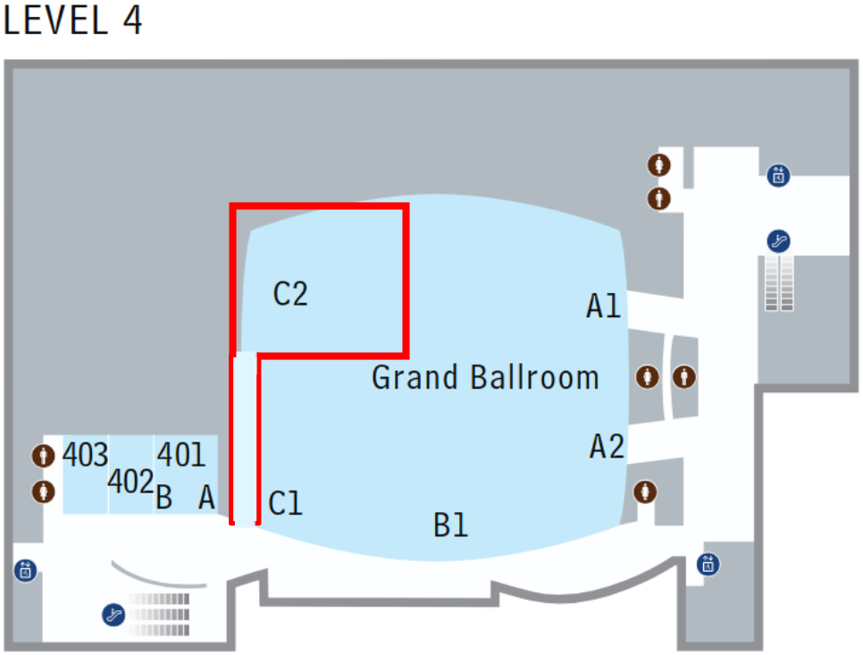
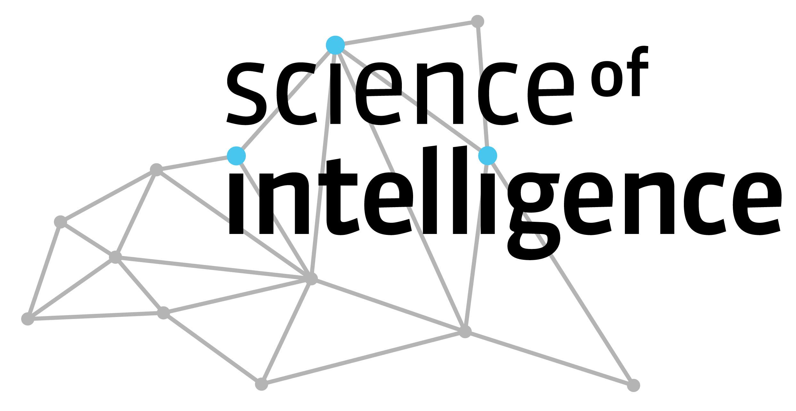

**June 12th, 2025, CVPR** (Full day workshop), Nashville (TN), USA.
<!-- Starts at **8 am [Eastern Time](https://time.is/ET)**;  6 pm [Europe Time](https://time.is/CET). -->  
Held in conjunction with the [IEEE/CVF Conference on Computer Vision and Pattern Recognition](https://cvpr.thecvf.com/) 2025.

<b>Welcome to the 5th International Workshop on Event-Based Vision!</b>  

Many thanks to all who contributed and made this workshop possible!

## [Photo Album of the Workshop](https://photos.app.goo.gl/mgCJHehT7KQYhzSr9)

<!--
## [Videos! YouTube Playlist](https://www.youtube.com/playlist?list=PLeXWz-g2If96iotpzgBNNTr9VA6hG-LLK)
-->

## [Please fill in the Survey: Neuromorphic Technology: What's Holding It Back?](https://lnkd.in/eqBiqwGt)

<!-- 
### It starts at 8 am [Local Time](https://time.is/Nashville)
-->

<!-- 
### Location
- **Posters**: ExHall D, poster **boards #280 - #359** at time 10:00 - 13:30. Push pins will be available.
- **Talks**: 4th level, Grand Ballroom C2
-->

<!--  -->
<!--  -->

<!--

-->

## Invited Speakers

 
## Schedule

<table style="width: 100%">
  <colgroup>
    <col span="1" style="width: 10%;">
    <col span="1" style="width: 90%;">
  </colgroup>
  <thead>
    <tr>
      <th>Time</th>
      <th>Speaker and Title </th>
    </tr>
  </thead>
  <tbody>
    <tr>
      <td bgcolor="WhiteSmoke">08:00</td>
      <td bgcolor="WhiteSmoke"><b>SESSION 1</b></td>
    </tr>
    <tr>
      <td>08:00</td>
      <td><b><a href="https://docs.google.com/presentation/d/1q-LtQwCOLRmnQATlLhk_LX3O-xL2OHBE8GUcrhTgtcY/edit?usp=sharing"> Welcome and Organization (slides)</a></b>
      </td>
    </tr>    
    <tr>
      <td>08:05</td>
      <td><a href="https://rpg.ifi.uzh.ch/people_scaramuzza.html">Davide Scaramuzza</a> (University of Zurich, Switzerland)
      </td>
    </tr>
    <tr>
      <td>08:35</td>
      <td><a href="https://www.professoren.tum.de/en/cremers-daniel">Daniel Cremers</a> (TU Munich, Germany)
      </td>
    </tr>
    <tr>
      <td>09:05</td>
      <td><a href="https://seas.yale.edu/faculty-research/faculty-directory/priya-panda">Priyadarshini Panda (Yale University, USA)</a>
      </td>
    </tr>
    <tr>
      <td>09:40</td>
      <td>Introduction of 4 Challenges: Eye-tracking, Deblurring, Segmentation and SLAM.
      </td>
    </tr>
    <tr>
      <td bgcolor="LavenderBlush">10:00</td>
      <td bgcolor="LavenderBlush"><b>Coffee break. Set up posters</b></td>
    </tr>
    <tr>
      <td bgcolor="WhiteSmoke">10:30</td>
      <td bgcolor="WhiteSmoke"><b>SESSION 2</b></td>
    </tr>
    <tr>
      <td bgcolor="LemonChiffon">10:30</td>
      <td bgcolor="LemonChiffon"> Poster session: contributed papers, demos, challenges  and courtesy papers (as posters). Boards 280 -- 359.
      </td>
    </tr>
    <tr>
      <td bgcolor="LavenderBlush">12:30</td>
      <td bgcolor="LavenderBlush"><b>Lunch break</b></td>
    </tr>
    <tr>
      <td bgcolor="WhiteSmoke">13:30</td>
      <td bgcolor="WhiteSmoke"><b>SESSION 3</b></td>
    </tr>
    <tr>
      <td>13:30</td>
      <td><a href="https://niklasfunk.com/">Niklas Funk</a> (TU Darmstadt, Germany)
      </td>
    </tr>
    <tr>
      <td>13:55</td>
      <td><a href="https://www.cs.umd.edu/people/metzler">Christopher Metzler</a> (University of Maryland, USA)
      </td>
    </tr>
    <tr>
      <td>14:20</td>
      <td><a href="https://people.mpi-inf.mpg.de/~golyanik/">Vladislav Golyanik</a> (Max-Planck-Institut für Informatik, Germany)
      </td>
    </tr>
    <tr>
      <td>14:45</td>
      <td><a href="https://ieeexplore.ieee.org/author/37089197011">Ziwei Wang</a> (ANU, Australia)
      </td>
    </tr>
    <tr>
      <td bgcolor="LavenderBlush">15:10</td>
      <td bgcolor="LavenderBlush"><b>Coffee break</b></td>
    </tr>
    <tr>
      <td bgcolor="WhiteSmoke">16:00</td>
      <td bgcolor="WhiteSmoke"><b>SESSION 4</b></td>
    </tr>
    <tr>
      <td>16:00</td>
      <td><a href="https://www.linkedin.com/in/hussain-sajwani-1709a6196/?originalSubdomain=ae">Hussain Sajwani</a> (Khalifa University, UAE)
      </td>
    </tr>
    <tr>
      <td>16:20</td>
      <td><a href="http://shibashintaro.com/">Shintaro Shiba</a> (Woven by Toyota, Japan)
      </td>
    </tr>
    <tr>
      <td>16:40</td>
      <td><a href="https://www.kitware.com/scott-mccloskey/">Scott McCloskey</a> (Kitware, USA)
      </td>
    </tr>
    <tr>
      <td>17:00</td>
      <td><a href="https://www.synsense.ai/">Kynan Eng</a> (SynSense Group, Switzerland)
      </td>
    </tr>
    <tr>
      <td>17:30</td>
      <td><a href="https://www.linkedin.com/in/davidemigliore/">Davide Migliore</a> (Tempo Sense, USA)
      </td>
    </tr>
    <tr>
      <td bgcolor="LightGreen">17:50</td>
      <td bgcolor="LightGreen"><b><a href="https://docs.google.com/presentation/d/1Fbk2UOAekj5SfXke3-b2WZuArfGeaeHWwL7iFe6Rdzs/edit?usp=sharing">Award Ceremony</a></b>
      </td>
    </tr>   
  </tbody>
</table>

## Objectives

Event-based cameras are bio-inspired, asynchronous sensors that offer key advantages of microsecond temporal resolution, low latency, high dynamic range and low power consumption. Because of these advantages, event-based cameras open frontiers that are unthinkable with traditional (frame-based) cameras, which have been the main sensing technology for the past 60 years. These revolutionary sensors enable the design of a new class of efficient algorithms to track a baseball in the moonlight, build a flying robot with the agility of a bee, and perform
structure from motion in challenging lighting conditions and at remarkable speeds. In the last decade, research about these sensors has attracted the attention of industry and academia, fostering exciting advances in the field. The proposed workshop covers the sensing hardware, as well as the processing, data, and learning methods needed to take advantage of the above-mentioned novel cameras. The workshop also considers novel vision sensors, such as
pixel processor arrays, which perform massively parallel processing near the image plane. Because early vision computations are carried out on-sensor (mimicking the retina), the resulting systems have high speed and low-power consumption, enabling new embedded vision applications in areas such as robotics, AR/VR, automotive, gaming, surveillance, etc.

## Topics Covered

- Event-based / neuromorphic vision.
- Algorithms: motion estimation, visual(-inertial) odometry, SLAM, 3D reconstruction, image
intensity reconstruction, optical flow estimation, recognition, segmentation, feature/object
detection, visual tracking, calibration, action understanding, sensor fusion (video synthesis,
events and RGB, events and LiDAR, etc.), model-based, embedded, or learning-based
approaches.
- Event-based representation, signal processing, and control.
- Event-based active vision, event-based sensorimotor integration.
- Event camera datasets and/or simulators.
- Applications in: computational photography, robotics (navigation, manipulation, drones, obstacle avoidance, human-robot interaction,...), automotive, IoT, AR/VR (e.g., smart eyewear), space science, automated inspection, surveillance, crowd counting, physics, biology.
- Novel hardware (cameras, neuromorphic processors, etc.) and/or software platforms, such as
fully event-based systems (end-to-end).
- New trends and challenges in event-based and/or biologically-inspired vision (SNNs, Reservoir
Computing, etc.).
- Efficient computing architectures for Event-based processing (e.g., HD Computing, State
Space Models).
- Near-focal plane processing, such as pixel processor arrays (PPAs).

A longer list of related topics is available in the table of content of the [List of Event-based Vision Resources](https://github.com/uzh-rpg/event-based_vision_resources)

<!--
## Call for Contributions

### Research papers

  <b>Research papers</b> and demos are solicited in, but not limited to, the topics listed above.

  - <b>Paper</b> submissions must adhere to the CVPR 2025 paper submission style, format and length restrictions.
  See the <a href="https://cvpr.thecvf.com/Conferences/2025/AuthorGuidelines">author guidelines</a> and <a href="https://github.com/cvpr-org/author-kit/releases">template</a> provided by the CVPR main conference. These submissions are meant to represent novel contributions, i.e., unpublished work (submissions should not have been published, accepted or be under review elsewhere).
   Accepted papers will be published open access through the Computer Vision Foundation (CVF) (see <a href="https://openaccess.thecvf.com/CVPR2023_workshops/EventVision">examples from CVPR Workshop 2023</a>, <a href="https://openaccess.thecvf.com/CVPR2021_workshops/EventVision">2021</a> <a href="https://openaccess.thecvf.com/CVPR2019_workshops/CVPR2019_EventVision">and 2019</a>). We encourage authors of accepted papers to write a paragraph about ethical considerations and impact of their work.
  
  - For <b>demo</b> abstract submission, authors are encouraged to submit an abstract of up to 2 pages using the same template as CVPR 2025 paper submissions.
-->

## [Proceedings at The Computer Vision Foundation (CVF)](https://openaccess.thecvf.com/CVPR2025_workshops/EventVision)

### List of accepted papers and live demos
1. [Dynamic EventNeRF: Reconstructing General Dynamic Scenes from Multi-view RGB and Event Streams](https://openaccess.thecvf.com/content/CVPR2025W/EventVision/html/Rudnev_Dynamic_EventNeRF_Reconstructing_General_Dynamic_Scenes_from_Multi-view_RGB_and_CVPRW_2025_paper.html)
2. [Event Quality Score (EQS): Assessing the Realism of Simulated Event Camera Streams via Distances in Latent Space](https://openaccess.thecvf.com/content/CVPR2025W/EventVision/html/Chanda_Event_Quality_Score_EQS_Assessing_the_Realism_of_Simulated_Event_CVPRW_2025_paper.html)
3. [E-VLC: A Real-World Dataset for Event-based Visible Light Communication And Localization](https://openaccess.thecvf.com/content/CVPR2025W/EventVision/html/Shiba_E-VLC_A_Real-World_Dataset_for_Event-based_Visible_Light_Communication_And_CVPRW_2025_paper.html)
4. [EV-Flying: an Event-based Dataset for In-The-Wild Recognition of Flying Objects](https://openaccess.thecvf.com/content/CVPR2025W/EventVision/html/Magrini_EV-Flying_an_Event-based_Dataset_for_In-The-Wild_Recognition_of_Flying_Objects_CVPRW_2025_paper.html)
5. [BiasBench: A reproducible benchmark for tuning the biases of event cameras](https://openaccess.thecvf.com/content/CVPR2025W/EventVision/html/Ziegler_BiasBench_A_reproducible_benchmark_for_tuning_the_biases_of_event_CVPRW_2025_paper.html)
6. [MTevent: A Multi-Task Event Camera Dataset for 6D Pose Estimation and Moving Object Detection](https://openaccess.thecvf.com/content/CVPR2025W/EventVision/html/Awasthi_MTevent_A_Multi-Task_Event_Camera_Dataset_for_6D_Pose_Estimation_CVPRW_2025_paper.html)
7. [Looking into the Shadow: Recording a Total Solar Eclipse with High-resolution Event Cameras](https://openaccess.thecvf.com/content/CVPR2025W/EventVision/html/Cladera_Looking_into_the_Shadow_Recording_a_Total_Solar_Eclipse_with_CVPRW_2025_paper.html)
8. [Probabilistic Online Event Downsampling](https://openaccess.thecvf.com/content/CVPR2025W/EventVision/html/Girbau-Xalabarder_Probabilistic_Online_Event_Downsampling_CVPRW_2025_paper.html)
9. [Making Every Event Count: Balancing Data Efficiency and Accuracy in Event Camera Subsampling](https://openaccess.thecvf.com/content/CVPR2025W/EventVision/html/Araghi_Making_Every_Event_Count_Balancing_Data_Efficiency_and_Accuracy_in_CVPRW_2025_paper.html)
10. [Learning from Noise: Enhancing DNNs for Event-Based Vision through Controlled Noise Injection](https://openaccess.thecvf.com/content/CVPR2025W/EventVision/html/Kowalczyk_Learning_from_Noise_Enhancing_DNNs_for_Event-Based_Vision_through_Controlled_CVPRW_2025_paper.html)
11. [Towards Low-Latency Event-based Obstacle Avoidance on a FPGA-Drone](https://openaccess.thecvf.com/content/CVPR2025W/EventVision/html/Bonazzi_Towards_Low-Latency_Event-based_Obstacle_Avoidance_on_a_FPGA-Drone_CVPRW_2025_paper.html)
12. [Real-Time Pedestrian Detection at the Edge on a Fully Asynchronous Neuromorphic System](https://openaccess.thecvf.com/content/CVPR2025W/EventVision/html/Bulzomi_Real-Time_Pedestrian_Detection_at_the_Edge_on_a_Fully_Asynchronous_CVPRW_2025_paper.html)
13. [DELTA: Dense Depth from Events and LiDAR using Transformer’s Attention](https://openaccess.thecvf.com/content/CVPR2025W/EventVision/html/Brebion_DELTA_Dense_Depth_from_Events_and_LiDAR_using_Transformers_Attention_CVPRW_2025_paper.html)
14. [Quadrocular, Neuromorphic Stereo Triangulation and Asynchronous Data Fusion for 3D Object Tracking](https://openaccess.thecvf.com/content/CVPR2025W/EventVision/html/Sengupta_Quadrocular_Neuromorphic_Stereo_Triangulation_and_Asynchronous_Data_Fusion_for_3D_CVPRW_2025_paper.html)
15. [Nanoparticle Diameter Measurements With Event Camera Tracking](https://openaccess.thecvf.com/content/CVPR2025W/EventVision/html/Daugherty_Nanoparticle_Diameter_Measurements_With_Event_Camera_Tracking_CVPRW_2025_paper.html)
16. [Egocentric Event-Based Vision for Ping Pong Ball Trajectory Prediction](https://openaccess.thecvf.com/content/CVPR2025W/EventVision/html/Alberico_Egocentric_Event-Based_Vision_for_Ping_Pong_Ball_Trajectory_Prediction_CVPRW_2025_paper.html)
17. [Event-Driven Dynamic Attention for Multi-Object Tracking on Neuromorphic Hardware](https://openaccess.thecvf.com/content/CVPR2025W/EventVision/html/Aitsam_Event-Driven_Dynamic_Attention_for_Multi-Object_Tracking_on_Neuromorphic_Hardware_CVPRW_2025_paper.html)
18. [Event-based Tracking and Imaging of Randomly Moving Objects in Dense Dynamical Scattering Media](https://openaccess.thecvf.com/content/CVPR2025W/EventVision/html/Zhang_Event-based_Tracking_and_Imaging_of_Randomly_Moving_Objects_in_Dense_CVPRW_2025_paper.html)
19. [Perturbed State Space Feature Encoders for Optical Flow with Event Cameras](https://openaccess.thecvf.com/content/CVPR2025W/EventVision/html/Raju_Perturbed_State_Space_Feature_Encoders_for_Optical_Flow_with_Event_CVPRW_2025_paper.html)
20. [Spatio-Temporal State Space Model For Efficient Event-Based Optical Flow](https://openaccess.thecvf.com/content/CVPR2025W/EventVision/html/Humais_Spatio-Temporal_State_Space_Model_For_Efficient_Event-Based_Optical_Flow_CVPRW_2025_paper.html)
21. [Best Linear Unbiased Estimation for 2D and 3D Flow with Event-based Cameras](https://openaccess.thecvf.com/content/CVPR2025W/EventVision/html/Valerdi_Best_Linear_Unbiased_Estimation_for_2D_and_3D_Flow_with_CVPRW_2025_paper.html)
22. [Iterative Event-based Motion Segmentation by Variational Contrast Maximization](https://openaccess.thecvf.com/content/CVPR2025W/EventVision/html/Yamaki_Iterative_Event-based_Motion_Segmentation_by_Variational_Contrast_Maximization_CVPRW_2025_paper.html)
23. [EV-LayerSegNet: Self-supervised Motion Segmentation using Event Cameras](https://openaccess.thecvf.com/content/CVPR2025W/EventVision/html/Farah_EV-LayerSegNet_Self-supervised_Motion_Segmentation_using_Event_Cameras_CVPRW_2025_paper.html)
24. [Seeing like a Cephalopod: Colour Vision with a Monochrome Event Camera](https://openaccess.thecvf.com/content/CVPR2025W/EventVision/html/Arja_Seeing_like_a_Cephalopod_Colour_Vision_with_a_Monochrome_Event_CVPRW_2025_paper.html)
25. [Event-based Continuous Color Video Decompression from Single Frames](https://openaccess.thecvf.com/content/CVPR2025W/EventVision/html/Wang_Event-based_Continuous_Color_Video_Decompression_from_Single_Frames_CVPRW_2025_paper.html)
26. [Reading in the Dark with Foveated Event Vision](https://openaccess.thecvf.com/content/CVPR2025W/EventVision/html/Brander_Reading_in_the_Dark_with_Foveated_Event_Vision_CVPRW_2025_paper.html)
27. [Human-Robot Navigation using Event-based Cameras and Reinforcement Learning](https://openaccess.thecvf.com/content/CVPR2025W/EventVision/html/Bugueno-Cordova_Human-Robot_Navigation_using_Event-based_Cameras_and_Reinforcement_Learning_CVPRW_2025_paper.html)
28. [E-BARF: Bundle Adjusting Neural Radiance Fields from a Moving Event Camera](https://openaccess.thecvf.com/content/CVPR2025W/EventVision/html/Tang_E-BARF_Bundle_Adjusting_Neural_Radiance_Fields_from_a_Moving_Event_CVPRW_2025_paper.html)
29. [Event-based eye tracking. Even-based Vision Workshop 2025](https://openaccess.thecvf.com/content/CVPR2025W/EventVision/html/Chen_Event-based_eye_tracking._Even-based_Vision_Workshop_2025_CVPRW_2025_paper.html)
30. [BRAT: Bidirectional Relative Positional Attention Transformer for Event-based Eye tracking](https://openaccess.thecvf.com/content/CVPR2025W/EventVision/html/Wu_BRAT_Bidirectional_Relative_Positional_Attention_Transformer_for_Event-based_Eye_tracking_CVPRW_2025_paper.html)
31. [Exploring Temporal Dynamics in Event-based Eye Tracker](https://openaccess.thecvf.com/content/CVPR2025W/EventVision/html/Huang_Exploring_Temporal_Dynamics_in_Event-based_Eye_Tracker_CVPRW_2025_paper.html)
32. [Dual-Path Enhancements in Event-Based Eye Tracking: Augmented Robustness and Adaptive Temporal Modeling](https://openaccess.thecvf.com/content/CVPR2025W/EventVision/html/Truong_Dual-Path_Enhancements_in_Event-Based_Eye_Tracking_Augmented_Robustness_and_Adaptive_CVPRW_2025_paper.html)
33. [Live Demonstration: Augmented Reality Applications Using Active Markers With An Event Camera](https://openaccess.thecvf.com/content/CVPR2025W/EventVision/html/Shiba_Augmented_Reality_Applications_Using_Active_Markers_With_An_Event_Camera_CVPRW_2025_paper.html)
34. [Live Demonstration: Point-Feature Tracking for Pixel Processor Arrays](https://openaccess.thecvf.com/content/CVPR2025W/EventVision/html/Bose_Demo__Point-Feature_Tracking_for_Pixel_Processor_Arrays_CVPRW_2025_paper.html)
35. [Live Demonstration: NeuroTouch - A Neuromorphic Vision-based Tactile Sensor for Real-Time Gesture Recognition](https://openaccess.thecvf.com/content/CVPR2025W/EventVision/html/Hoffmann_Live_Demonstration_NeuroTouch_-_A_Neuromorphic_Vision-based_Tactile_Sensor_for_CVPRW_2025_paper.html)
36. [Live Demonstration: Real-time event-data processing with Graph Convolutional Neural Networks and SoC FPGA](https://openaccess.thecvf.com/content/CVPR2025W/EventVision/html/Wzorek_Live_Demonstration_Real-time_event-data_processing_with_Graph_Convolutional_Neural_Networks_CVPRW_2025_paper.html)
37. Reading Events Hierarchically to Reduce Latency
 
<!--
### Courtesy papers (in the poster session)

  We also solicit contributions of <b>papers relevant to the workshop that are accepted</b> at the CVPR main conference or at other peer-reviewed conferences or journals.
  These contributions will be checked for suitability (soft review) and will not be published in the workshop proceedings.
  Papers should be submitted in single blind format (e.g., accepted version is fine), and should mention if and where the paper has been accepted / published. These contributions provide visibility to your work and help build a community around the topics of the workshop. 
  

-->

### List of Courtesy papers
1. [NTIRE 2025 Challenge on Event-Based Image Deblurring: Methods and Results](https://www.arxiv.org/pdf/2504.12401), CVPRW 2025.
2. [Graph Neural Network Combining Event Stream and Periodic Aggregation for Low-Latency Event-based Vision](https://openaccess.thecvf.com/content/CVPR2025/papers/Dampfhoffer_Graph_Neural_Network_Combining_Event_Stream_and_Periodic_Aggregation_for_CVPR_2025_paper.pdf), CVPR 2025.
3. [Repurposing Pre-trained Video Diffusion Models for Event-based Video Interpolation](https://arxiv.org/pdf/2412.07761), CVPR 2025.
4. [ETAP: Event-based Tracking of Any Point](https://github.com/tub-rip/ETAP), CVPR 2025.
5. [EBS-EKF: Accurate and High Frequency Event-based Star Tracking](https://arxiv.org/pdf/2503.20101), CVPR 2025.
6. [Event fields: Capturing light fields at high speed, resolution, and dynamic range](https://arxiv.org/pdf/2412.06191), CVPR 2025.
7. [On-Device Self-Supervised Learning of Low-Latency Monocular Depth from Only Events](https://arxiv.org/pdf/2412.06359), CVPR 2025.
8. [Bridge Frame and Event: Common Spatiotemporal Fusion for High-Dynamic Scene Optical Flow](https://arxiv.org/pdf/2503.06992), CVPR 2025.
9. [Ev-3DOD: Pushing the Temporal Boundaries of 3D Object Detection with Event Cameras](https://arxiv.org/pdf/2502.19630), CVPR 2025.
10. [TimeTracker: Event-based Continuous Point Tracking for Video Frame Interpolation with Non-linear Motion](https://arxiv.org/pdf/2505.03116), CVPR 2025.
11. [EventFly: Event Camera Perception from Ground to the Sky](https://arxiv.org/pdf/2503.19916), CVPR 2025.
12. [DiET-GS: Diffusion Prior and Event Stream-Assisted Motion Deblurring 3D Gaussian Splatting](https://arxiv.org/pdf/2503.24210), CVPR 2025.
13. [Event Ellipsometer: Event-based Mueller-Matrix Video Imaging](https://arxiv.org/pdf/2411.17313), CVPR 2025.
14. [IncEventGS: Pose-Free Gaussian Splatting from a Single Event Camera](https://arxiv.org/pdf/2410.08107), CVPR 2025.
15. [PS-EIP: Robust Photometric Stereo Based on Event Interval Profile](https://arxiv.org/pdf/2503.18341), CVPR 2025.
16. [Efficient Event-Based Object Detection: A Hybrid Neural Network with Spatial and Temporal Attention](https://arxiv.org/pdf/2403.10173v3), CVPR 2025.
17. [EMBA: Event-based Mosaicing Bundle Adjustment](https://github.com/tub-rip/emba), ECCV 2024.
18. [Neuromorphic Facial Analysis with Cross-Modal Supervision](https://www.arxiv.org/pdf/2409.10213), ECCVW 2024.
19. [Distance Estimation in Outdoor Driving Environments Using Phase-only Correlation Method with Event Cameras](https://arxiv.org/pdf/2505.17582), IEEE IV 2025.
20. [Evaluation of Mobile Environment for Vehicular Visible Light Communication Using Multiple LEDs and Event Cameras](https://arxiv.org/pdf/2505.15412), IEEE IV 2025.
21. [EvMAPPER: High Altitude Orthomapping with Event Cameras](https://arxiv.org/abs/2409.18120), ICRA 2025.
22. [Neural Inertial Odometry from Lie Events](https://roboticsconference.org/program/papers/143/), RSS 2025.

## Competitions / Challenges

### 1. Eye-tracking

Overview: This challenge focuses on advancing event-based eye tracking, a key technology for driving innovations in interaction technology, extended reality (XR) and cognitive studies. 
While current state-of-the-art devices like Apple's Vision Pro or Meta’s Aria glasses utilize frame-based eye tracking with frame rates from 10 to 100 Hz and latency around 11 ms, there is a pressing need for smoother, faster, and more efficient methods to enhance user experience. By leveraging the event-based eye tracking dataset (<a href="https://openaccess.thecvf.com/content/CVPR2024W/AI4Streaming/papers/Wang_Event-Based_Eye_Tracking._AIS_2024_Challenge_Survey_CVPRW_2024_paper.pdf">3ET+ dataset</a>), this challenge offers participants the opportunity to contribute to cutting-edge solutions that push beyond current limitations. Top-1-ranking team will get a Meta Quest 3 as the prize (Sponsored by DVsense). 

  <a href="https://lab-ics.github.io/3et-2025.github.io/"><b>Eye-tracking Challenge website</b></a>

<b>Timeline</b>:
<ul>
  <li>Challenge Start: February 15, 2025</li>
  <li>Challenge End: March 15, 2025</li>
  <li>Top-ranking teams will be invited to submit factsheet, code, and workshop paper after competition ends, the submission deadline: March 25, 2025</li>
  <li>Top-ranking teams will be invited to write challenge report together, the deadline: April 5, 2025</li>
  <li>Paper review deadline: April 5, 2025 </li>
</ul>

<b>Contact</b>:
<ul>
  <li><a href="https://sites.google.com/view/qinyu">Prof. Qinyu Chen</a> (q.chen [at] liacs [dot] leidenuniv [dot] nl)</li>
  <li><a href="https://www.tudemi.com/">Prof. Chang Gao</a> (chang.gao [at] tudelft [dot] nl)</li>
  <!-- <li><a href="mailto:dperrone@prophesee.ai">Dr. Daniele Perrone</a></li> -->
</ul>

---

### 2. Space-time Instance Segmentation (SIS) Challenge

      
<b>Overview</b>:
<ul>
    <li><b>Task</b>: Predict mask-accurate tracks of all mouse instances from input events (and optional frames).</li>
    <li><b>Data</b>: This challenge is based on the <a href="https://github.com/tub-rip/MouseSIS"><b>MouseSIS dataset</b></a>.</li>
    <li><b>Two Tracks</b>: (1) Frame + Events Track, and (2) Events-only Track.</li>
</ul>  

<a href="https://www.codabench.org/competitions/5600/"><b>Challenge Page (Codabench)</b></a>

<b>Timeline</b>:
<ul>
 <li><b>February 7, 2025</b>: Challenge opens for submissions</li>
 <li><b>May 23, 2025</b>: Challenge closes, final submission deadline</li>
 <li><b>May 26, 2025</b>: Winners announced.
 Top teams are invited to:
    <ul>
        <li>submit factsheets and code</li>
        <li>collaborate on challenge report</li>
        <li>present a poster at the CVPR workshop</li>
    </ul>
 </li>
 <li><b>June 6, 2025</b>: Deadline for top teams to submit: Factsheets, Code and Challenge report.
 </li>
 <li><b>June 12, 2025</b>: Results presentation (Posters) at CVPR 2025 Workshop on Event-based Vision</li>
</ul>

<b>Contact</b>:
<a href="https://friedhelmhamann.github.io/">Friedhelm Hamann</a> (f.hamann [at] tu-berlin [dot] de)

---

### 3. Event-Based Image Deblurring Challenge

<b>Overview</b>:

This challenge focuses on leveraging the high-temporal-resolution events from event cameras to improve image deblurring. We hope that this challenge will serve as a starting point for promoting event-based image enhancement on a broader stage and contribute to the thriving development of the event-based vision community.

<ul>
    <li><b>Task</b>: To obtain a network design / solution that fusing events and images produces high quality results with the best performance (i.e., PSNR).</li>
    <li><b>Data</b>: This challenge is based on the <a href="https://github.com/AHupuJR/NTIRE2025_EventDeblur_challenge"><b>HighREV dataset</b></a>.</li>
</ul>  

<a href="https://codalab.lisn.upsaclay.fr/competitions/21498"><b>Challenge Page (CodaLab)</b></a>

<b>Timeline</b>:
<ul>
 <li><b>February 10, 2025</b>: Challenge opens for submissions</li>
 <li><b>March 15, 2025</b>: Final test data release</li>
 <li><b>March 21, 2025</b>: Challenge ends: submission deadline to upload results on the final test data</li>
 <li><b>March 22, 2025</b>: Fact sheets and code/executable submission deadline</li>
 <li><b>March 24, 2025</b>: Preliminary test results release to the participants</li>
 <li><b>March 29, 2025</b>: Paper submission deadline for entries from the challenge, as per the <a href="https://cvlai.net/ntire/2025/">NTIRE-W page</a> </li>
 <li><b>June 11-12, 2025</b>: Results presentation at CVPR 2025 Workshop NTIRE (June 11) and/or Workshop on Event-based Vision (June 12), as a poster.</li>
</ul>

<b>Contact</b>:
<a href="https://ahupujr.github.io/">Lei Sun</a> (leo_sun [at] zju [dot] edu [dot] cn)

---

### 4. Event-Based SLAM Challenge

<b>Overview</b>:

The goal of this challenge is to leverage the high temporal and spatial resolution of HD event cameras for SLAM and pose estimation applications.

Please refer to the <a href="http://m3ed.io/slam_challenge/">challenge website</a> for more information about participation.

Tracks:
<ul>
    <li><b>Event (+ IMU)</b>: if you obtain your pose using a single or a pair of event cameras, with or without IMU.</li>
    <li><b>Event + Mono (+ IMU)</b>: if you obtain your pose using a single or a pair of event cameras fused with monocular global shutter cameras, with or without IMU.</li>
</ul>

<b>Timeline</b>:
<ul>
 <li><b>March 1, 2025</b>: Challenge opens for submissions</li>
 <li><b><del>June 2</del> <ins>June 9</ins>, 2025</b>: Challenge ends</li>
 <li><b><del>June 8</del> <ins>June 9</ins>, 2025</b>: The top submissions should send their code for manual evaluation, report, and posters.</li>
 <li><b><del>June 4</del> <ins>June 10</ins>, 2025</b>: Winners announced</li>
 <li><b>June 12, 2025</b>: Posters presented at the CVPR Workshop on Event-based vision.</li>
 <li>After the workshop: The top submissions are invited to collaborate on a report for the challenge.</li>
</ul>

<b>Contact:</b>
<ul>
  <li><a href="https://fcladera.com/#about">Fernando Cladera</a> (fclad [at] seas.upenn.edu)</li>
  <li><a href="https://www.grasp.upenn.edu/people/kenneth-chaney/">Dr. Kenneth Chaney</a> (chaneyk [at] seas.upenn.edu)</li>
</ul>

<!--
---

## Location
- On site (Music City Center, Nashville TN): Room <b>4th level, Grand Ballroom C2</b>
- [Virtual: see CVPR virtual platform for zoom link](https://cvpr2023.thecvf.com/virtual/2023/workshop/18456) 

## Schedule

The tentative schedule is the following:

Time (local) | Session
--- | ---
8:00 | Welcome. Session 1: Event cameras: Algorithms and applications I (Invited speakers)
10:10 | Coffee break. Set up posters.
10:30 | Session 2: Poster session: contributed papers, competitions, demos and courtesy presentations (as posters).
12:30 | Lunch break
13:30 | Session 3: Event cameras: Algorithms and applications II (Invited speakers)
15:30 | Coffee break
16:00 | Session 4: Hardware architectures and sensors (Invited speakers)
17:45 | Award Ceremony and Final Panel Discussion.
18:00 | End
-->

## Organizers

<!--  -->

- [Guillermo Gallego](http://www.guillermogallego.es), TU Berlin, Germany.
- [Kostas Daniilidis](https://www.cis.upenn.edu/~kostas), University of Pennsylvania, USA.
- [Cornelia Fermüller](http://users.umiacs.umd.edu/~fer), University of Maryland, USA.
- [Daniele Perrone](https://scholar.google.ch/citations?user=BoIN3HkAAAAJ), [Prophesee](https://www.prophesee.ai/), France.
- [Davide Migliore](https://www.linkedin.com/in/davidemigliore), Tempo Sense, USA.

## Important Dates

- **~~Paper submission deadline: March 19 (was March 12)~~**, 2025 (23:59h PST).  **[Submission website (CMT)](https://cmt3.research.microsoft.com/EVENTVISION2025)**
- **~~Demo abstract submission: March 19 (was March 12)~~**, 2025 (23:59h PST)
- ~~Reviewers fill in review reports: March 28.~~
- ~~Organizers notify authors: March 31st.~~
- ~~**Authors of accepted papers submit meta-data via Google form: March 31st**.~~
- ~~Authors receive instructions for camera-ready preparation: by April 6th.~~
- ~~Authors submit **camera-ready paper: April 14**, 2025 (as per CVPR website, firm deadline set by IEEE) using IEEE Computer Society's Conference Publishing Services ([CPS](https://ieeecps.org/cps/v2/auth/login))~~
- ~~Early-bird registration **April 30th**~~
- [Register for the Workshop / Conference](https://cvpr.thecvf.com/Conferences/2025/Pricing2).
- <b>Workshop day: **June 12th, 2025**. Full day workshop, start at 8 am.</b>

## FAQs
<ul>
  <li><b>What is an event camera?</b> Watch this <a href="https://youtu.be/LauQ6LWTkxM">video explanation</a>.</li>
  <li><b>What are possible applications of event cameras?</b> Check the <b><a href="https://arxiv.org/abs/1904.08405">TPAMI 2022 review paper</a></b>.
  </li>
  <li><b>Where can I buy an event camera?</b> From <a href="https://github.com/uzh-rpg/event-based_vision_resources#companies_sftwr"> Inivation, Prophesee, Lucid, etc.</a>.</li>
  <li><b>Are there datasets and simulators that I can play with?</b> Yes, <a href="http://rpg.ifi.uzh.ch/davis_data.html">Dataset</a>. <a href="http://rpg.ifi.uzh.ch/esim.html">Simulator</a>. <a href="https://github.com/uzh-rpg/event-based_vision_resources#datasets">More</a>.</li>
  <li><b>Is there any online course about event-based vision?</b> Yes, check this <a href="https://sites.google.com/view/guillermogallego/teaching/event-based-robot-vision"> course at TU Berlin</a>.</li>
  <li><b>What is the SCAMP sensor?</b> Read this <a href="https://personalpages.manchester.ac.uk/staff/p.dudek/scamp/">page explanation</a>.</li>
  <li><b>What are possible applications of the scamp sensor?</b> Some applications can be found <a href="https://personalpages.manchester.ac.uk/staff/p.dudek/scamp/default.htm#Applications">here</a>.</li>
  <li><b>Where can I buy a SCAMP sensor?</b> Contact Prof. <a href="https://personalpages.manchester.ac.uk/staff/p.dudek/pdudek.htm">Piotr Dudek</a>.</li>
  <li><b>Where can I find more information?</b> Check out this <a href="https://github.com/uzh-rpg/event-based_vision_resources">List of Event-based Vision Resources</a>.</li>
</ul>

## Related Workshops

<ul>
  <li><a href="https://tub-rip.github.io/eventvision2023/">CVPR 2023 Fourth International Workshop on Event-based Vision</a>. 
  <a href="https://www.youtube.com/playlist?list=PLeXWz-g2If96iotpzgBNNTr9VA6hG-LLK">Videos</a></li>
  <li><a href="https://tub-rip.github.io/eventvision2021/">CVPR 2021 Third International Workshop on Event-based Vision</a>.
  <a href="https://www.youtube.com/playlist?list=PLeXWz-g2If95mjNpA-y-WIoDaoB8WtmE7">Videos</a></li>
  <li><a href="http://rpg.ifi.uzh.ch/CVPR19_event_vision_workshop.html">CVPR 2019 Second International Workshop on Event-based Vision</a>.
  <a href="https://www.youtube.com/playlist?list=PLeXWz-g2If97iGiuBHmnW8IFIxwvSeCHx">Videos</a></li>
  <li><a href="http://rpg.ifi.uzh.ch/ICRA17_event_vision_workshop.html">ICRA 2017 First International Workshop on Event-based Vision</a>.
  <a href="https://www.youtube.com/playlist?list=PLeXWz-g2If94k8mw6GcKU5C9PUgM1sK0U">Videos</a></li>
</ul>

## Upcoming Workshops

<ul>
  <li><a href="https://sites.google.com/view/nevi-2025/home-page">ICCV 2025: 2nd Workshop on Neuromorphic Vision (NeVi 2025)</a></li> 
    <li><a href="https://sites.google.com/view/neurobots2025">IROS 2025: NeuRobots 2025. Workshop on Neuromorphic Perception for Real World Robotics</a></li> 
</ul>

See also [this link](https://github.com/uzh-rpg/event-based_vision_resources?tab=readme-ov-file#workshops)

## Supported by

## Ack

The <a href="https://cmt3.research.microsoft.com">Microsoft CMT service</a> was used for managing the peer-reviewing process for this conference. This service was provided for free by Microsoft and they bore all expenses, including costs for Azure cloud services as well as for software development and support.
